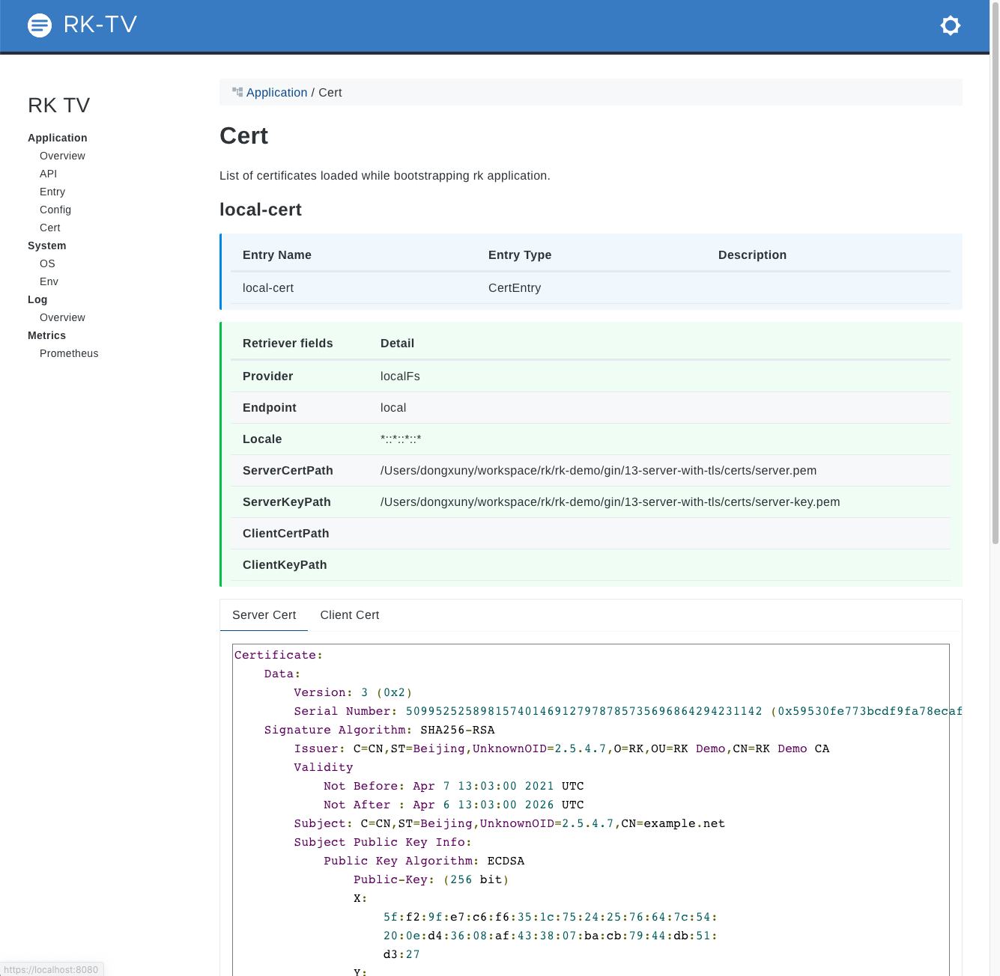

# Simple Gin server demo
This is the simplest gin server demo with bellow functionality enabled.
- Gin Server
- Swagger UI
- RK common service (A list of commonly used APIs)
- Prometheus client
- Logging interceptor
- Metrics interceptor
- BasicAuth interceptor
- RK TV
- Application Info
- Zap Logger
- Event Logger
- Viper Config
- TLS

<!-- START doctoc generated TOC please keep comment here to allow auto update -->
<!-- DON'T EDIT THIS SECTION, INSTEAD RE-RUN doctoc TO UPDATE -->
**Table of Contents**  *generated with [DocToc](https://github.com/thlorenz/doctoc)*

- [Quick start](#quick-start)
  - [Start server](#start-server)
  - [Check logs/ directory](#check-logs-directory)
  - [Directory layout](#directory-layout)
  - [boot.yaml](#bootyaml)

<!-- END doctoc generated TOC please keep comment here to allow auto update -->

## Quick start
### Start server
Run main.go in the terminal or run it from your IDE directly.

```go
go run main.go 
```

### Access with https
- Swagger UI
https://localhost:8080/sw
- Prometheus client
https://localhost:8080/metrics
- RK TV
https://localhost:8008/rk/v1/tv

### View certificates details
Open https://localhost:8080/rk/v1/tv/cert



### Directory layout

```shell script
├── Makefile
├── README.md
├── boot.yaml
├── certs
│   ├── server-key.pem
|   └── server.pem
├── docs
|   ├── docs.go
│   ├── swagger.json
│   └── swagger.yaml
├── go.mod
├── go.sum
├── logs
│   └── greeter.log
│   └── greeter-event.log
└── main.go
```

### boot.yaml
We are using the simplest way of boot.yaml with cert detail.
Available swagger configurations listed bellow.

| Name | Description | Default |
| ------ | ------ | ------ |
| cert.consul.name | Name of consul retriever | "" |
| cert.consul.locale | Represent environment of current process follows schema of \<realm\>::\<region\>::\<az\>::\<domain\> | \*::\*::\*::\* | 
| cert.consul.endpoint | Endpoint of Consul server, http://x.x.x.x or x.x.x.x both acceptable. | N/A |
| cert.consul.datacenter | consul datacenter. | "" |
| cert.consul.token | Token for access consul. | "" |
| cert.consul.basicAuth | Basic auth for consul server, like <user:pass>. | "" |
| cert.consul.serverCertPath | Path of server cert in Consul server. | "" |
| cert.consul.serverKeyPath | Path of server key in Consul server. | "" |
| cert.consul.clientCertPath | Path of client cert in Consul server. | "" |
| cert.consul.clientCertPath | Path of client key in Consul server. | "" |
| cert.etcd.name | Name of etcd retriever | "" |
| cert.etcd.locale | Represent environment of current process follows schema of \<realm\>::\<region\>::\<az\>::\<domain\> | \*::\*::\*::\* | 
| cert.etcd.endpoint | Endpoint of etcd server, http://x.x.x.x or x.x.x.x both acceptable. | N/A |
| cert.etcd.basicAuth | Basic auth for etcd server, like <user:pass>. | "" |
| cert.etcd.serverCertPath | Path of server cert in etcd server. | "" |
| cert.etcd.serverKeyPath | Path of server key in etcd server. | "" |
| cert.etcd.clientCertPath | Path of client cert in etcd server. | "" |
| cert.etcd.clientCertPath | Path of client key in etcd server. | "" |
| cert.localFs.name | Name of localFs retriever | "" |
| cert.localFs.locale | Represent environment of current process follows schema of \<realm\>::\<region\>::\<az\>::\<domain\> | \*::\*::\*::\* | 
| cert.localFs.serverCertPath | Path of server cert in local file system. | "" |
| cert.localFs.serverKeyPath | Path of server key in local file system. | "" |
| cert.localFs.clientCertPath | Path of client cert in local file system. | "" |
| cert.localFs.clientCertPath | Path of client key in local file system. | "" |
| cert.remoteFs.name | Name of remoteFileStore retriever | "" |
| cert.remoteFs.locale | Represent environment of current process follows schema of \<realm\>::\<region\>::\<az\>::\<domain\> | \*::\*::\*::\* | 
| cert.remoteFs.endpoint | Endpoint of remoteFileStore server, http://x.x.x.x or x.x.x.x both acceptable. | N/A |
| cert.remoteFs.basicAuth | Basic auth for remoteFileStore server, like <user:pass>. | "" |
| cert.remoteFs.serverCertPath | Path of server cert in remoteFs server. | "" |
| cert.remoteFs.serverKeyPath | Path of server key in remoteFs server. | "" |
| cert.remoteFs.clientCertPath | Path of client cert in remoteFs server. | "" |
| cert.remoteFs.clientCertPath | Path of client key in remoteFs server. | "" |

- Full cert config
```yaml
---
cert:
#  - name: "etcd-cert"                        # Required
#    description: "Description of entry"      # Optional
#    provider: "etcd"                         # Required, etcd, consul, localFs, remoteFs are supported options
#    locale: "*::*::*::*"                     # Optional, default: *::*::*::*
#    endpoint: "localhost:2379"               # Required, http://x.x.x.x or x.x.x.x both acceptable.
#    basicAuth: "root:etcd"                   # Optional, default: "", basic auth for Consul server, like <user:pass>
#    serverCertPath: "serverCert"             # Optional, default: "", key of value in etcd
#    serverKeyPath: "serverKey"               # Optional, default: "", key of value in etcd
#    clientCertPath: "clientCert"             # Optional, default: "", key of value in etcd
#    clientKeyPath: "clientKey"               # Optional, default: "", key of value in etcd
  - name: "local-cert"                        # Required
    description: "Description of entry"       # Optional
    provider: "localFs"                       # Required, etcd, consul, localFs, remoteFs are supported options
    locale: "*::*::*::*"                      # Optional, default: *::*::*::*
    serverCertPath: "example/server.pem"      # Optional, default: "", path of certificate on local FS
    serverKeyPath: "example/server-key.pem"   # Optional, default: "", path of certificate on local FS
#    clientCertPath: "example/client.pem"     # Optional, default: "", path of certificate on local FS
#    clientKeyPath: "example/client.pem"      # Optional, default: "", path of certificate on local FS
#  - name: "consul-cert"                      # Required
#    provider: "consul"                       # Required, etcd, consul, localFS, remoteFs are supported options
#    description: "Description of entry"      # Optional
#    locale: "*::*::*::*"                     # Optional, default: *::*::*::*
#    endpoint: "localhost:8500"               # Required, http://x.x.x.x or x.x.x.x both acceptable.
#    basicAuth: "user:pass"                   # Optional, default: "", basic auth for consul server, like <user:pass>
#    datacenter: "rk"                         # Optional, default: "", consul datacenter
#    token: ""                                # Optional, default: "", token to access consul
#    serverCertPath: "serverCert"             # Optional, default: "", key of value in consul
#    serverKeyPath: "serverKey"               # Optional, default: "", key of value in consul
#    clientCertPath: "clientCert"             # Optional, default: "", key of value in consul
#    clientKeyPath: "clientKey"               # Optional, default: "", key of value in consul
#  - name: "remoteFs-cert"                    # Required
#    description: "Description of entry"      # Optional
#    provider: "remoteFs"                     # Required, etcd, consul, localFs, remoteFs are supported options
#    locale: "*::*::*::*"                     # Optional, default: *::*::*::*
#    endpoint: "localhost:8080"               # Required, http://x.x.x.x or x.x.x.x both acceptable.
#    basicAuth: "user:pass"                   # Optional, default: "", basic auth for remote file store, like <user:pass>
#    serverCertPath: "serverCert"             # Optional, default: "", path of file in remote file store
#    serverKeyPath: "serverKey"               # Optional, default: "", path of file in remote file store
#    clientCertPath: "clientCert"             # Optional, default: "", path of file in remote file store
#    clientKeyPath: "clientKey"               # Optional, default: "", path of file in remote file store
```

- The simplest cert config
```yaml
---
rk:
  appName: rk-example-entry
  version: v0.0.1
  description: "this is description"
  keywords: ["rk", "golang"]
  homeUrl: "http://example.com"
  iconUrl: "http://example.com"
  docsUrl: ["http://example.com"]
  maintainers: ["rk-dev"]
cert:
  - name: "local-cert"                        # Required
    provider: "localFs"                       # Required, etcd, consul, localFs, remoteFs are supported options
    locale: "*::*::*::*"                      # Optional, default: *::*::*::*
    serverCertPath: "certs/server.pem"        # Optional, default: "", path of certificate on local FS
    serverKeyPath: "certs/server-key.pem"     # Optional, default: "", path of certificate on local FS
config:
  - name: my-config
    path: configs/my-config.yaml
    locale: "*::*::*::*"
zapLogger:
  - name: logger                              # Required
    zap:
      outputPaths: ["logs/greeter.log"]
eventLogger:
  - name: event-logger                        # Required
    outputPaths: ["logs/greeter-event.log"]
gin:
  - name: greeter                             # Required
    port: 8080                                # Required
    description: "greeter server"
    cert:
      ref: "local-cert"
    sw:
      enabled: true
      jsonPath: "docs"
    prom:
      enabled: true
    tv:
      enabled: true
    commonService:
      enabled: true
    interceptors:
      loggingZap:
        enabled: true
      metricsProm:
        enabled: true
      basicAuth:
        enabled: true
        credentials:
         - "rk-user:rk-pass"
    logger:                                   # Optional
      zapLogger:                              # Optional
        ref: logger                           # Optional, default: logger of STDOUT, reference of logger entry declared above
      eventLogger:                            # Optional
        ref: event-logger                     # Optional, default: logger of STDOUT, reference of logger entry declared above
```
