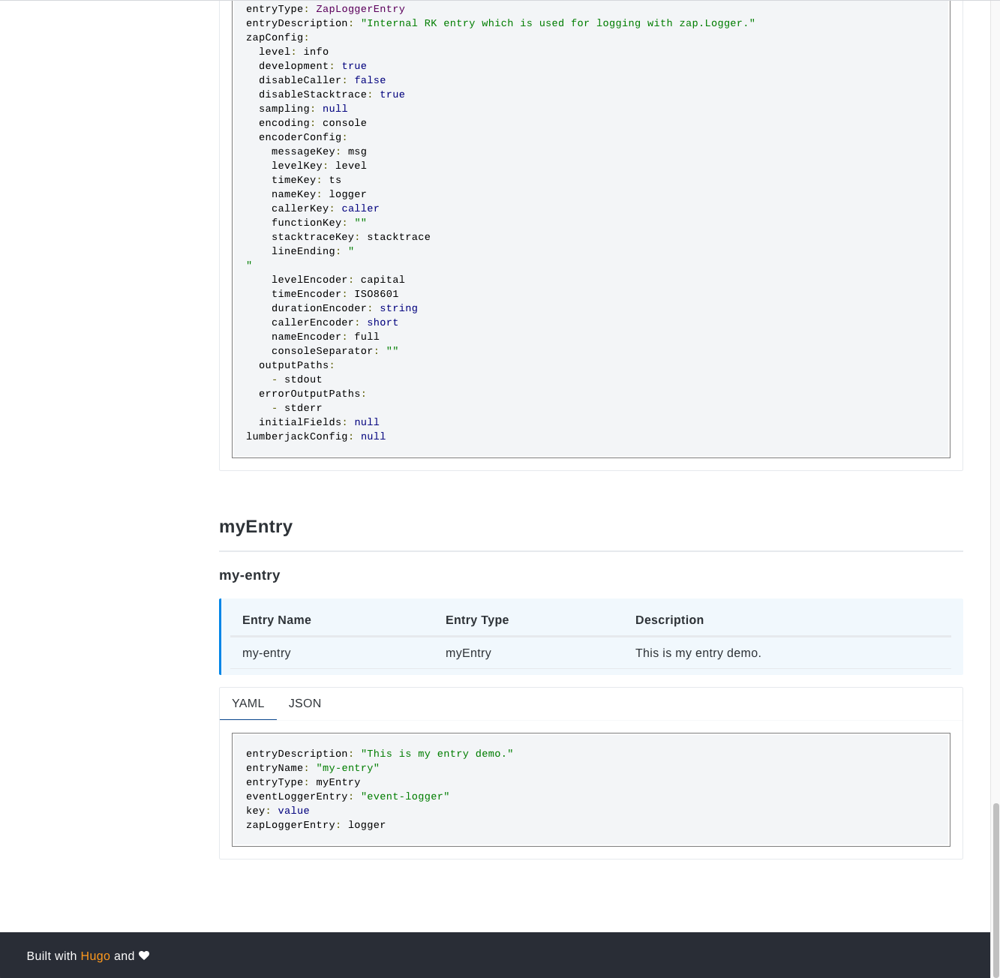

# Simple Gin server demo
This is the simplest gin server demo with bellow functionality enabled.
- Gin Server
- Swagger UI
- RK common service (A list of commonly used APIs)
- Prometheus client
- Logging interceptor
- Metrics interceptor
- BasicAuth interceptor
- RK TV
- Application Info
- Zap Logger
- Event Logger
- Viper Config
- TLS
- Custom entry

<!-- START doctoc generated TOC please keep comment here to allow auto update -->
<!-- DON'T EDIT THIS SECTION, INSTEAD RE-RUN doctoc TO UPDATE -->
**Table of Contents**  *generated with [DocToc](https://github.com/thlorenz/doctoc)*

- [Quick start](#quick-start)
  - [Start server](#start-server)
  - [Check logs/ directory](#check-logs-directory)
  - [Directory layout](#directory-layout)
  - [boot.yaml](#bootyaml)

<!-- END doctoc generated TOC please keep comment here to allow auto update -->

## Quick start
### Start server
Run main.go in the terminal or run it from your IDE directly.

```go
go run main.go 
```

### Access RK TV view custom entry
https://localhost:8080/rk/v1/tv/entry



### Directory layout

```shell script
├── Makefile
├── README.md
├── boot.yaml
├── certs
│   ├── server-key.pem
|   └── server.pem
├── docs
|   ├── docs.go
│   ├── swagger.json
│   └── swagger.yaml
├── go.mod
├── go.sum
├── logs
│   └── greeter.log
│   └── greeter-event.log
└── main.go
```

### boot.yaml
Users can define their own yaml config to parse.

- Full myEntry config
```yaml
---
rk:
  appName: rk-example-entry
  version: v0.0.1
  description: "this is description"
  keywords: ["rk", "golang"]
  homeUrl: "http://example.com"
  iconUrl: "http://example.com"
  docsUrl: ["http://example.com"]
  maintainers: ["rk-dev"]
cert:
  - name: "local-cert"                        # Required
    provider: "localFs"                       # Required, etcd, consul, localFs, remoteFs are supported options
    locale: "*::*::*::*"                      # Optional, default: *::*::*::*
    serverCertPath: "certs/server.pem"        # Optional, default: "", path of certificate on local FS
    serverKeyPath: "certs/server-key.pem"     # Optional, default: "", path of certificate on local FS
config:
  - name: my-config
    path: configs/my-config.yaml
    locale: "*::*::*::*"
zapLogger:
  - name: logger                              # Required
    zap:
      outputPaths: ["logs/greeter.log"]
eventLogger:
  - name: event-logger                        # Required
    outputPaths: ["logs/greeter-event.log"]
gin:
  - name: greeter                             # Required
    port: 8080                                # Required
    description: "greeter server"
    cert:
      ref: "local-cert"
    sw:
      enabled: true
      jsonPath: "docs"
    prom:
      enabled: true
    tv:
      enabled: true
    commonService:
      enabled: true
    interceptors:
      loggingZap:
        enabled: true
      metricsProm:
        enabled: true
      basicAuth:
        enabled: true
        credentials:
         - "rk-user:rk-pass"
    logger:                                   # Optional
      zapLogger:                              # Optional
        ref: logger                           # Optional, default: logger of STDOUT, reference of logger entry declared above
      eventLogger:                            # Optional
        ref: event-logger                     # Optional, default: logger of STDOUT, reference of logger entry declared above
myEntry:
  enabled: true
  name: my-entry
  description: "This is my entry demo."
  key: value
  logger:
    zapLogger:
      ref: logger
    eventLogger:
      ref: event-logger
```
