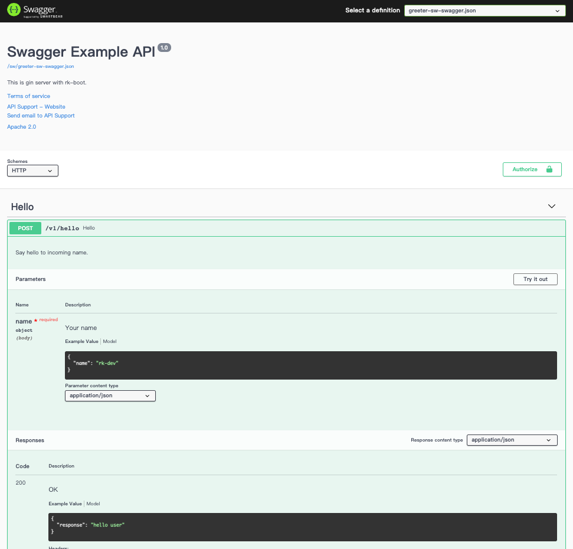

# Simple Gin server demo
This is the simplest gin server demo with bellow functionality enabled.
- Gin Server
- Swagger UI

<!-- START doctoc generated TOC please keep comment here to allow auto update -->
<!-- DON'T EDIT THIS SECTION, INSTEAD RE-RUN doctoc TO UPDATE -->
**Table of Contents**  *generated with [DocToc](https://github.com/thlorenz/doctoc)*

- [Quick start](#quick-start)
  - [Start server](#start-server)
  - [Open swagger UI](#open-swagger-ui)
  - [Directory layout](#directory-layout)
  - [boot.yaml](#bootyaml)
  - [main.go](#maingo)

<!-- END doctoc generated TOC please keep comment here to allow auto update -->

## Quick start
### Start server
Run main.go in the terminal or run it from your IDE directly.

```go
go run main.go 
```

### Open swagger UI
http://localhost:8080/sw




[Swagger UI tutorial](https://swagger.io/tools/swagger-ui/)

### Directory layout
simple-server demo contains 6 files in simple-server-with-swagger/ directory.

- boot.yaml

boot.yaml is the bootstrap config file for rk-boot, rk-boot will read this file to start Gin server.

We locate boot.yaml file in the root working directory. As a result, we didn't specify file path of bootstrapper config file 
in the main.go function. Because rk-boot will look for bootstrapper file in the root working directory named as boot.yaml
if not specified.

- main.go

main.go is entry of main program which contains /v1/hello handler.

- docs

Generated with [swag](https://github.com/swaggo/swag) command line tool. 

```shell script
swag init --generalInfo main.go --propertyStrategy camelcase
```

```shell script
├── Makefile
├── README.md
├── boot.yaml
├── docs
|   ├── docs.go
│   ├── swagger.json
│   └── swagger.yaml
├── go.mod
├── go.sum
└── main.go
```

### boot.yaml
We are using the simplest way of boot.yaml with swagger enabled.
Available swagger configurations listed bellow.

| name | description | type | default value |
| ------ | ------ | ------ | ------ |
| gin.sw.enabled | Enable swagger | boolean | false | 
| gin.sw.path | Swagger path | string | / |
| gin.sw.jsonPath | Swagger json file path | string | / |
| gin.sw.headers | Headers will send with swagger response | array | [] |

```yaml
---
gin:
  - name: greeter                     # Required
    port: 8080                        # Required
    description: "greeter server"
    sw:
      enabled: true
      jsonPath: "docs"
```

### main.go
In order to generate swagger json file, we need to comment main() and each of gin handler with swag sytle.

Please refer [swag](https://github.com/swaggo/swag) for details.

```go
// Copyright (c) 2021 rookie-ninja
//
// Use of this source code is governed by an MIT-style
// license that can be found in the LICENSE file.
package main

import (
	"context"
	"errors"
	"github.com/gin-gonic/gin"
	"github.com/google/uuid"
	"github.com/rookie-ninja/rk-boot"
	"net/http"
)

// @title Swagger Example API
// @version 1.0
// @description This is gin server with rk-boot.
// @termsOfService http://swagger.io/terms/
// @contact.name API Support
// @contact.url http://www.swagger.io/support
// @contact.email support@swagger.io
// @license.name Apache 2.0
// @license.url http://www.apache.org/licenses/LICENSE-2.0.html
// @schemes http https
func main() {
	// Create a new boot instance.
	boot := rkboot.NewBoot()

	// Register handler
	boot.GetGinEntry("greeter").Router.GET("/v1/hello", hello)

	// Bootstrap
	boot.Bootstrap(context.TODO())
}

// @Summary Hello
// @Description Say hello to incoming name.
// @Id v1.api.hello
// @Accept  application/json
// @Tags Hello
// @version 1.0
// @Param name query string true "Your name"
// @Produce application/json
// @Success 200 {object} helloResponse
// @Failure 400 {object} httpError
// @Router /v1/hello [get]
// @Header all {string} request-id "Request id for with uuid generator."
func hello(ctx *gin.Context) {
	ctx.Header("request-id", uuid.New().String())

	if name := ctx.Query("name"); len(name) > 1 {
		NewError(ctx, http.StatusBadRequest, errors.New("name should not be nil"))
		return
	}

	ctx.JSON(http.StatusOK, &helloResponse{
		Response: "hello " + ctx.Query("name"),
	})
}

type helloResponse struct {
	Response string `json:"response" yaml:"response" example:"hello user"`
}

func NewError(ctx *gin.Context, status int, err error) {
	ctx.JSON(status, httpError{
		Code:    status,
		Message: err.Error(),
	})
}

type httpError struct {
	Code    int    `json:"code" yaml:"code" example:"400"`
	Message string `json:"message" yaml:"message" example:"status bad request"`
}
```
