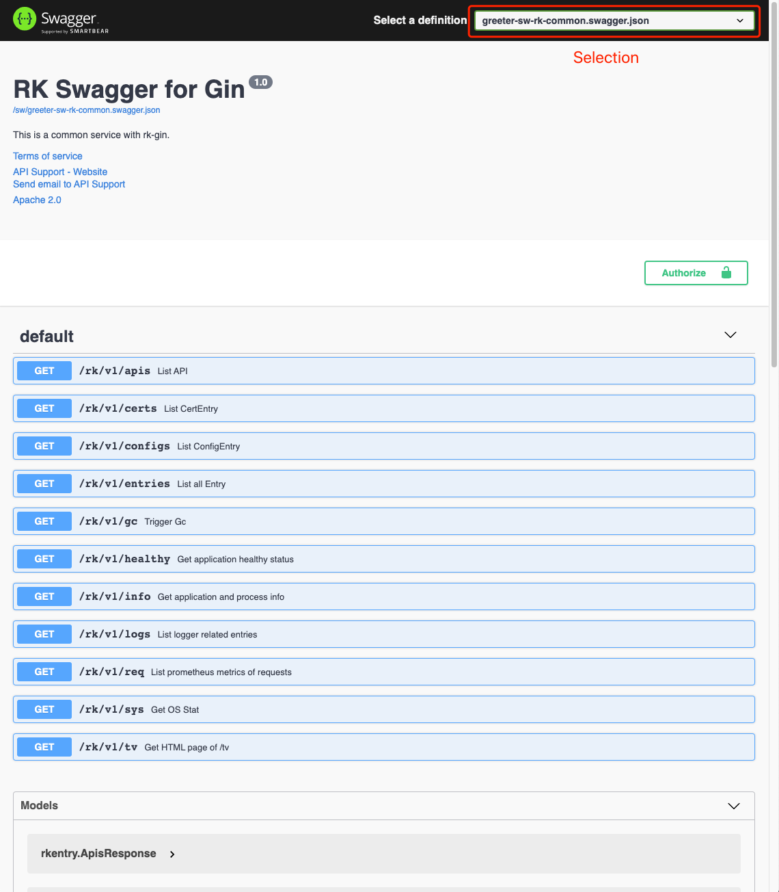

# Simple Gin server demo
This is the simplest gin server demo with bellow functionality enabled.
- Gin Server
- Swagger UI
- RK common service (A list of commonly used APIs)

<!-- START doctoc generated TOC please keep comment here to allow auto update -->
<!-- DON'T EDIT THIS SECTION, INSTEAD RE-RUN doctoc TO UPDATE -->
**Table of Contents**  *generated with [DocToc](https://github.com/thlorenz/doctoc)*

- [Quick start](#quick-start)
  - [Start server](#start-server)
  - [Open swagger UI](#open-swagger-ui)
  - [Directory layout](#directory-layout)
  - [boot.yaml](#bootyaml)

<!-- END doctoc generated TOC please keep comment here to allow auto update -->

## Quick start
### Start server
Run main.go in the terminal or run it from your IDE directly.

```go
go run main.go 
```

### Open swagger UI
Open http://localhost:8080/sw and select greeter-sw-rk-common.swagger.json.




[Swagger UI tutorial](https://swagger.io/tools/swagger-ui/)

### Directory layout

```shell script
├── Makefile
├── README.md
├── boot.yaml
├── docs
|   ├── docs.go
│   ├── swagger.json
│   └── swagger.yaml
├── go.mod
├── go.sum
└── main.go
```

### boot.yaml
We are using the simplest way of boot.yaml with common service enabled.
Available swagger configurations listed bellow.

| name | description | type | default value |
| ------ | ------ | ------ | ------ |
| gin.commonService.enabled | Enable common service | boolean | false |

```yaml
---
gin:
  - name: greeter                     # Required
    port: 8080                        # Required
    description: "greeter server"
    sw:
      enabled: true
      jsonPath: "docs"
    commonService:
      enabled: true
```
