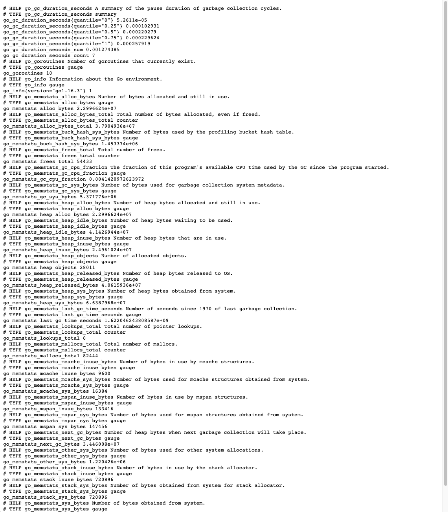
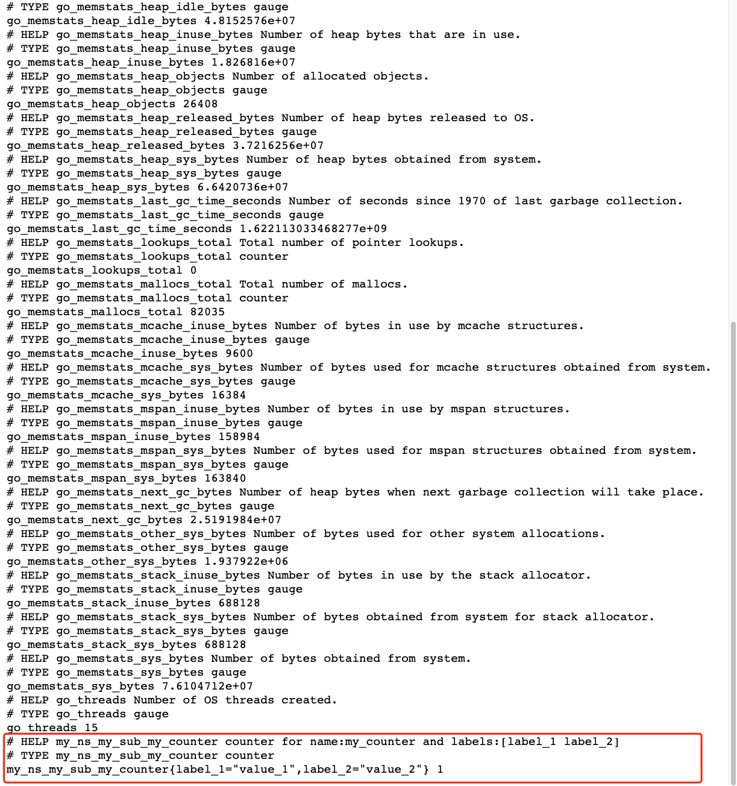

# Simple Gin server demo
This is the simplest gin server demo with bellow functionality enabled.
- Gin Server
- Swagger UI
- RK common service (A list of commonly used APIs)
- Prometheus client

<!-- START doctoc generated TOC please keep comment here to allow auto update -->
<!-- DON'T EDIT THIS SECTION, INSTEAD RE-RUN doctoc TO UPDATE -->
**Table of Contents**  *generated with [DocToc](https://github.com/thlorenz/doctoc)*

- [Quick start](#quick-start)
  - [Start server](#start-server)
  - [Open prometheus client](#open-prometheus-client)
  - [Directory layout](#directory-layout)
  - [boot.yaml](#bootyaml)

<!-- END doctoc generated TOC please keep comment here to allow auto update -->

## Quick start
### Start server
Run main.go in the terminal or run it from your IDE directly.

```go
go run main.go 
```

### Open prometheus client
http://localhost:8080/metrics



### Create custom metrics to prometheus
PromEntry would be created if we enabled prometheus from boot.yaml config. And prometheus.Registerer would be created
by default.

In order to create my own metrics(counter, gauge, summary, histogram), we need bellow steps.
- Create a metrics set
- Register a metrics(counter, gauge, summary, histogram)
- Record data into metrics

```go
// ***************** Create custom metrics *****************
// Since we enabled prometheus client, we could get PromEntry
promEntry := boot.GetGinEntry("greeter").PromEntry

// 1: Create a metrics set
// MetricsSet is a collection of counter, gauge, summary, histogram metrics.
// Each MetricsSet could be distinguished by <namespace> and <subsystem>.
// <namespace> and <subsystem> should follow bellow regex which is required by prometheus:
// ^[a-zA-Z_:][a-zA-Z0-9_:]*$
metricsSet := rkprom.NewMetricsSet("my_ns", "my_sub", promEntry.Registerer)

// 2: Register a metrics(counter, gauge, summary, histogram)
// Register a counter with name and label.
// Label should also follow regex of ^[a-zA-Z_:][a-zA-Z0-9_:]*$
if err := metricsSet.RegisterCounter("my_counter", "label_1", "label_2"); err != nil {
	panic(err)
}

// 3: Record data into metrics
// Get Counter with values and increase it.
// Number of values and types should match labels we set already.
metricsSet.GetCounterWithValues("my_counter", "value_1", "value_2").Inc()
```

We would see metrics from prometheus client as bellow:




### Directory layout

```shell script
├── Makefile
├── README.md
├── boot.yaml
├── docs
|   ├── docs.go
│   ├── swagger.json
│   └── swagger.yaml
├── go.mod
├── go.sum
└── main.go
```

### boot.yaml
We are using the simplest way of boot.yaml with prometheus enabled.
Available configurations listed bellow.

| name | description | type | default value |
| ------ | ------ | ------ | ------ |
| gin.prom.enabled | Enable prometheus | boolean | false |
| gin.prom.path | Path of prometheus | string | metrics |
| gin.prom.cert.ref |  Reference of cert entry declared in cert section | string | "" |
| gin.prom.pusher.enabled | Enable prometheus pusher | bool | false |
| gin.prom.pusher.jobName | Job name would be attached as label while pushing to remote pushgateway | string | "" |
| gin.prom.pusher.remoteAddress | PushGateWay address, could be form of http://x.x.x.x or x.x.x.x | string | "" |
| gin.prom.pusher.intervalMs | Push interval in milliseconds | string | 1000 |
| gin.prom.pusher.basicAuth | Basic auth used to interact with remote pushgateway, form of \<user:pass\> | string | "" |
| gin.prom.pusher.cert.ref | Reference of rkentry.CertEntry | string | "" |

```yaml
---
gin:
  - name: greeter                     # Required
    port: 8080                        # Required
    description: "greeter server"
    sw:
      enabled: true
      jsonPath: "docs"
    commonService:
      enabled: true
    prom:
      enabled: true
```
