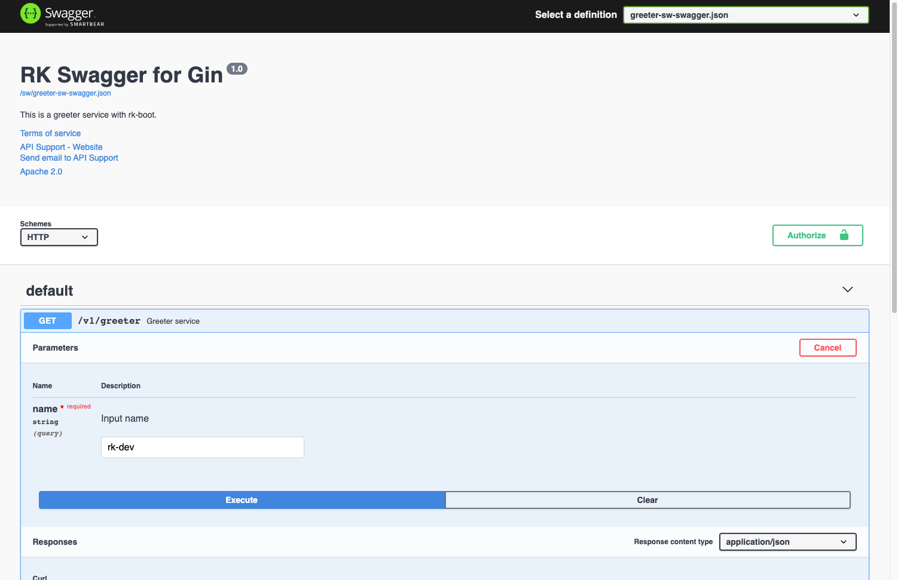

# Simple Gin server demo
This is the simplest gin server demo with bellow functionality enabled.
- Gin Server
- Swagger UI
- RK common service (A list of commonly used APIs)
- Prometheus client
- Logging interceptor

<!-- START doctoc generated TOC please keep comment here to allow auto update -->
<!-- DON'T EDIT THIS SECTION, INSTEAD RE-RUN doctoc TO UPDATE -->
**Table of Contents**  *generated with [DocToc](https://github.com/thlorenz/doctoc)*

- [Quick start](#quick-start)
  - [Start server](#start-server)
  - [Open swagger UI](#open-swagger-ui)
  - [Output](#output)
  - [Directory layout](#directory-layout)
  - [boot.yaml](#bootyaml)

<!-- END doctoc generated TOC please keep comment here to allow auto update -->

## Quick start
### Start server
Run main.go in the terminal or run it from your IDE directly.

```go
go run main.go 
```

### Open swagger UI
Open http://localhost:8080/sw and send a request to server.




[Swagger UI tutorial](https://swagger.io/tools/swagger-ui/)

### Output
Since we enabled logging interceptor, we will get log from stdout with [rk-query](https://github.com/rookie-ninja/rk-query) style.

It contains most important information about this API call.

```text
------------------------------------------------------------------------
endTime=2021-05-27T00:16:35.782136+08:00
startTime=2021-05-27T00:16:35.781918+08:00
elapsedNano=217382
hostname=lark.local
eventId=4353e93e-ccc4-4e98-944a-4daffcdc7d7b
timing={}
counter={}
pair={}
error={}
field={"apiMethod":"GET","apiPath":"/v1/hello","apiProtocol":"HTTP/1.1","apiQuery":"name=rk-dev","appName":"rkApp","appVersion":"v0.0.0","az":"unknown","domain":"unknown","elapsedNano":217382,"endTime":"2021-05-27T00:16:35.782136+08:00","entryName":"greeter","entryType":"gin","incomingRequestIds":[],"localIp":"10.8.0.2","outgoingRequestIds":["4353e93e-ccc4-4e98-944a-4daffcdc7d7b"],"realm":"unknown","region":"unknown","remoteIp":"localhost","remotePort":"58466","resCode":200,"startTime":"2021-05-27T00:16:35.781918+08:00","userAgent":"Mozilla/5.0 (Macintosh; Intel Mac OS X 10_15_6) AppleWebKit/537.36 (KHTML, like Gecko) Chrome/89.0.4389.128 Safari/537.36"}
remoteAddr=localhost:58466
appName=rkApp
appVersion=unknown
entryName=greeter
entryType=gin
locale=unknown
operation=GET:/v1/hello
eventStatus=Ended
resCode=200
timezone=CST
os=darwin
arch=amd64
EOE
```

### Directory layout

```shell script
├── Makefile
├── README.md
├── boot.yaml
├── docs
|   ├── docs.go
│   ├── swagger.json
│   └── swagger.yaml
├── go.mod
├── go.sum
└── main.go
```

### boot.yaml
We are using the simplest way of boot.yaml with logging interceptor enabled.
Available swagger configurations listed bellow.

| name | description | type | default value |
| ------ | ------ | ------ | ------ |
| gin.interceptors.loggingZap.enabled | Enable logging interceptor | boolean | false |

```yaml
---
gin:
  - name: greeter                     # Required
    port: 8080                        # Required
    description: "greeter server"
    sw:
      enabled: true
      jsonPath: "docs"
    prom:
      enabled: true
    commonService:
      enabled: true
    interceptors:
      loggingZap:
        enabled: true
```
