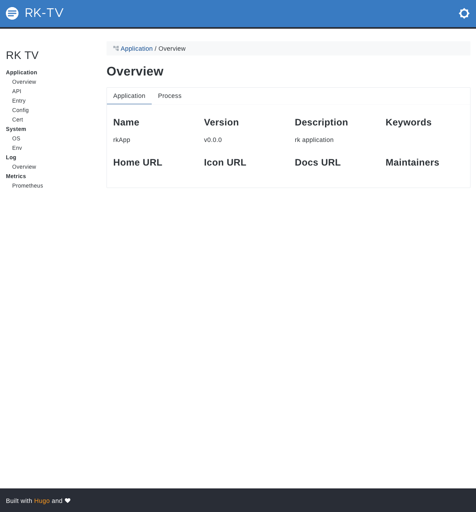

# Simple Gin server demo
This is the simplest gin server demo with bellow functionality enabled.
- Gin Server
- Swagger UI
- RK common service (A list of commonly used APIs)
- Prometheus client
- Logging interceptor
- Metrics interceptor
- BasicAuth interceptor
- RK TV

<!-- START doctoc generated TOC please keep comment here to allow auto update -->
<!-- DON'T EDIT THIS SECTION, INSTEAD RE-RUN doctoc TO UPDATE -->
**Table of Contents**  *generated with [DocToc](https://github.com/thlorenz/doctoc)*

- [Quick start](#quick-start)
  - [Start server](#start-server)
  - [Open RK TV web UI](#open-rk-tv-web-ui)
  - [Directory layout](#directory-layout)
  - [boot.yaml](#bootyaml)

<!-- END doctoc generated TOC please keep comment here to allow auto update -->

## Quick start
### Start server
Run main.go in the terminal or run it from your IDE directly.

```go
go run main.go 
```

### Open RK TV web UI
http://localhost:8080/rk/v1/tv



### Directory layout

```shell script
├── Makefile
├── README.md
├── boot.yaml
├── docs
|   ├── docs.go
│   ├── swagger.json
│   └── swagger.yaml
├── go.mod
├── go.sum
└── main.go
```

### boot.yaml
We are using the simplest way of boot.yaml with tv enabled.
Available swagger configurations listed bellow.

| name | description | type | default value |
| ------ | ------ | ------ | ------ |
| gin.tv.enabled | Enable RK TV whose path is /rk/v1/tv | boolean | false |

```yaml
---
gin:
  - name: greeter                     # Required
    port: 8080                        # Required
    description: "greeter server"
    sw:
      enabled: true
      jsonPath: "docs"
    prom:
      enabled: true
    tv:
      enabled: true
    commonService:
      enabled: true
    interceptors:
      loggingZap:
        enabled: true
      metricsProm:
        enabled: true
      basicAuth:
        enabled: true
        credentials:
         - "rk-user:rk-pass"
```
