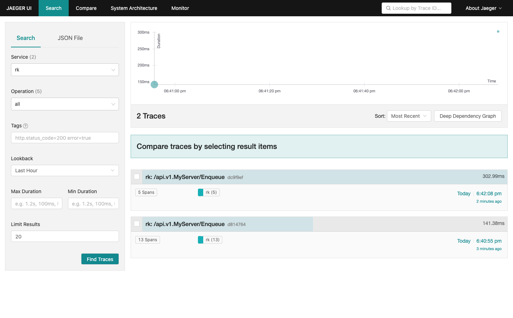
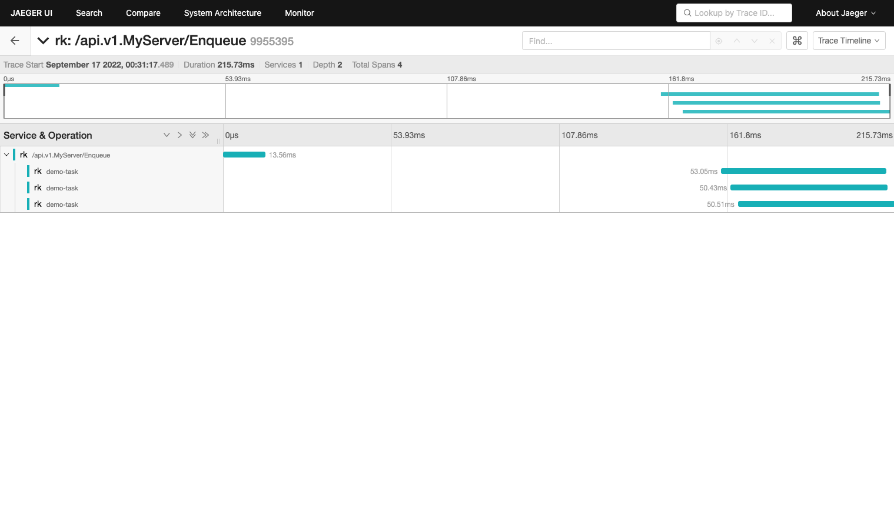

# Example
In this example, we will implement jaeger tracing between gRPC server and asynq worker server.

[grpc-server](grpc-server.go) will listen on port 8080 at path of localhost:8080/v1/enqueue.

[worker](worker.go) will start asynq worker server and consume tasks.

gRPC request and asynq task will be in the same trace with different span.

```shell
go get github.com/rookie-ninja/rk-boot/v2
go get github.com/rookie-ninja/rk-grpc/v2
go get github.com/rookie-ninja/rk-repo/asynq
```

## Quick start
### 1.Create grpc-server.yaml and trace.yaml
- grpc-server.yaml

```yaml
grpc:
  - name: greeter
    enabled: true
    port: 8080
    middleware:
      trace:
        enabled: true
        exporter:
          jaeger:
            agent:
              enabled: true
      logging:
        enabled: true
```

- trace.yaml

```yaml
asynq:
  trace:
    enabled: true
    exporter:
      jaeger:
        agent:
          enabled: true
```

### 2.Create grpc-server.go and worker.go
Please refer to [grpc-server.go](grpc-server.go) and [worker.go](worker.go) 

### 3.Run jaeger-all-in-one locally
```shell
docker run -d --name jaeger \
  -e COLLECTOR_ZIPKIN_HOST_PORT=:9411 \
  -e COLLECTOR_OTLP_ENABLED=true \
  -p 6831:6831/udp \
  -p 6832:6832/udp \
  -p 5778:5778 \
  -p 16686:16686 \
  -p 4317:4317 \
  -p 4318:4318 \
  -p 14250:14250 \
  -p 14268:14268 \
  -p 14269:14269 \
  -p 9411:9411 \
  jaegertracing/all-in-one:1.37 --query.max-clock-skew-adjustment 60s
```

### 4.Start grpc-server and worker

```shell
$ go run grpc-server.go
$ go run worker.go
```

### 4.Validation
#### 4.1 Send request to grpc-server
Since grpc-gateway is automatically enabled by default, we will use curl to send request.

```shell
curl localhost:8080/v1/enqueue
{}
```

#### 4.2 Open jaeger UI
[jaeger UI](http://localhost:16686/search)

Find recent trace.



