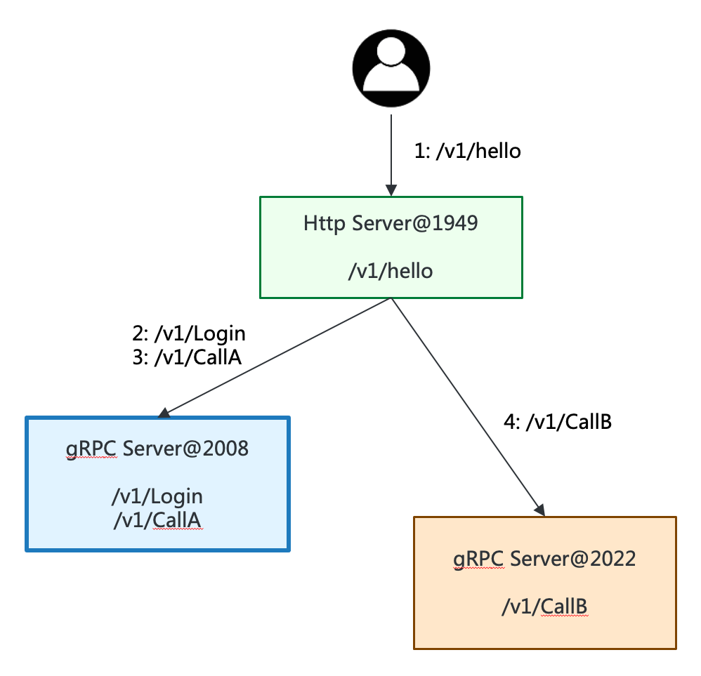
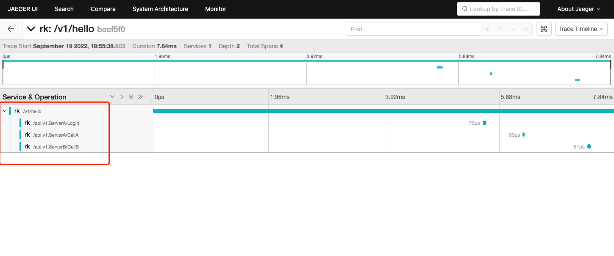

# Example
In this example, we will start one http server and two gRPC servers serverA and serverB and implement distributed logging.



## Install
```shell
go get github.com/rookie-ninja/rk-boot/v2
go get github.com/rookie-ninja/rk-grpc/v2
go get github.com/rookie-ninja/rk-gin/v2
```

## Quick start
### 1.Create bootA.yaml and bootB.yaml
- http-server.yaml

```yaml
gin:
  - name: httpServer
    enabled: true
    port: 1949
    middleware:
      trace:
        enabled: true
        exporter:
          jaeger:
            agent:
              enabled: true
      logging:
        enabled: true
```

- grpc-serverA.yaml

```yaml
grpc:
  - name: grpcServerA
    enabled: true
    port: 2008
    middleware:
      trace:
        enabled: true
        exporter:
          jaeger:
            agent:
              enabled: true
      logging:
        enabled: true
```

- grpc-serverB.yaml

```yaml
grpc:
  - name: grpcServerB
    enabled: true
    port: 2022
    middleware:
      trace:
        enabled: true
        exporter:
          jaeger:
            agent:
              enabled: true
      logging:
        enabled: true
```

### 2.Create grpc-serverA.go, grpc-serverB.go and http-server.go
Please refer to [grpc-serverA.go](grpc-serverA.go), [grpc-serverB.go](grpc-serverB.go) and [http-server.go](http-server.go)

> How to propagate span from http-server to grpc-serverA and grpc-serverB?
> 
> First, get span context from http-server which generated automatically by rk-boot. Second, inject span context into metadata and create new context
> ```go
> grpcCtx := trace.ContextWithRemoteSpanContext(context.Background(), rkginctx.GetTraceSpan(ctx).SpanContext())
> md := metadata.Pairs()
> rkginctx.GetTracerPropagator(ctx).Inject(grpcCtx, &rkgrpcctx.GrpcMetadataCarrier{Md: &md})
> grpcCtx = metadata.NewOutgoingContext(grpcCtx, md)
> ```

### 3.Start serverA and serverB

```shell
$ go run http-server.go
$ go run grpc-serverA.go
$ go run grpc-serverB.go
```

### 4.Validation
#### 4.1 Send request to http-server

```shell
curl localhost:1949/v1/hello
{"traceId":"beef5f01aaedd92da9e99d2e64ab63ba"}
```

#### 4.2 Validate log from grpc-serverA, grpc-serverB and http-server
- log from http-server

```shell
------------------------------------------------------------------------
ids={"eventId":"ef20e4cc-6781-4ef2-a303-9f064dd5fc76","traceId":"beef5f01aaedd92da9e99d2e64ab63ba"}
...
```

- log from grpc-serverA

```shell
------------------------------------------------------------------------
ids={"eventId":"0f6b8bec-98f7-4128-88f3-1e4a6cafaa12","traceId":"beef5f01aaedd92da9e99d2e64ab63ba"}
....
```

- log from grpc-serverB

```shell
------------------------------------------------------------------------
ids={"eventId":"0a8477f3-ef82-43fd-b2c3-e1f29f8c51a3","traceId":"beef5f01aaedd92da9e99d2e64ab63ba"}
....
```

#### 4.3 Jaeger

