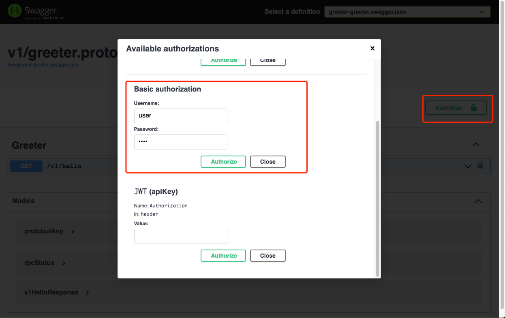
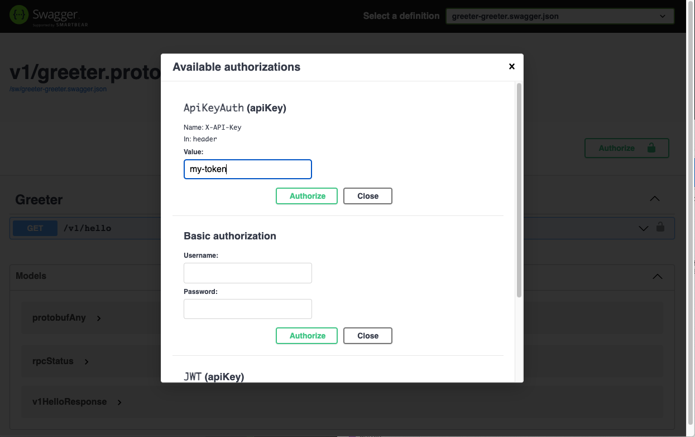
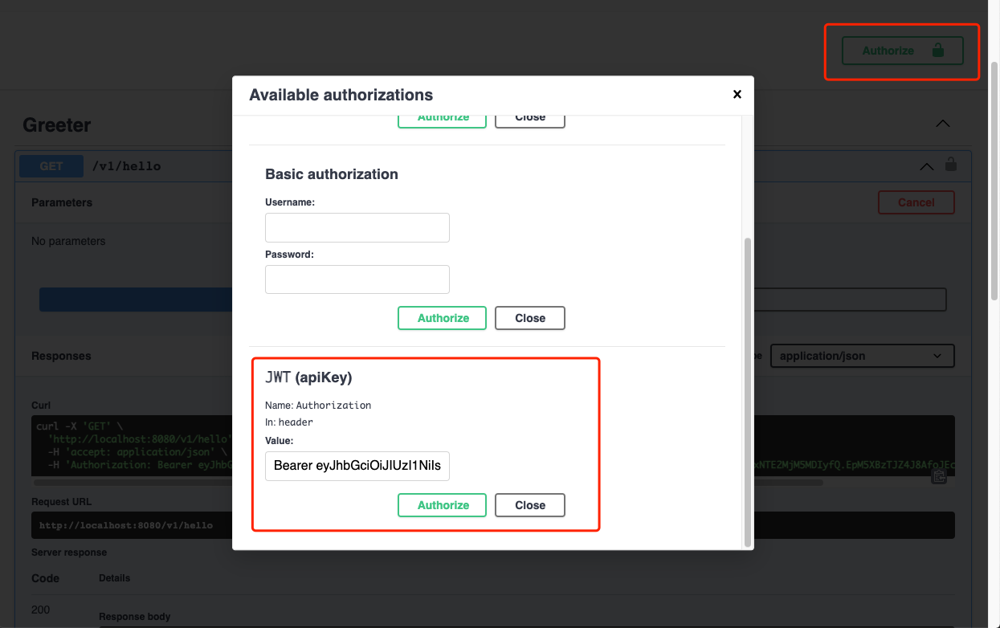

# Example
In this example, we will describe how to enable Auth (X-API-Key, Basic Auth, JWT) in swagger UI

```shell
go get github.com/rookie-ninja/rk-boot/v2
go get github.com/rookie-ninja/rk-grpc/v2
```

## Basic Auth
### 0.Add dependency in third-party/ folder
Please add dependency files in third-party folder as example.

### 1.Prepare .proto files
In this .proto file, we add openapiv2 option. Please visit [grpc-gateway](https://github.com/grpc-ecosystem/grpc-gateway/blob/master/protoc-gen-openapiv2/options/openapiv2.proto) for details.

- api/v1/greeter.proto

```protobuf
syntax = "proto3";

package api.v1;

import "protoc-gen-openapiv2/options/annotations.proto";

option go_package = "api/v1/greeter";

// Enable auth in swagger UI
option (grpc.gateway.protoc_gen_openapiv2.options.openapiv2_swagger) = {
  security_definitions: {
    // Enable BasicAuth
    security: {
      key: "BasicAuth",
      value: {
        type: TYPE_BASIC,
      },
    }
    // Enable X-API-Key
    security: {
      key: "ApiKeyAuth",
      value: {
        type: TYPE_API_KEY,
        name: "X-API-Key",
        in: IN_HEADER
      }
    }
    // Enable JWT
    security: {
      key: "JWT",
      value: {
        type: TYPE_API_KEY,
        name: "Authorization",
        in: IN_HEADER
      },
    }
  }
};

service Greeter {
  rpc Hello (HelloRequest) returns (HelloResponse) {
    // Reference to auth
    option (grpc.gateway.protoc_gen_openapiv2.options.openapiv2_operation) = {
      security: {
        // For BasicAuth
        security_requirement: {
          key: "BasicAuth";
          value: {}
        }
        // For ApiKeyAuth
        security_requirement: {
          key: "ApiKeyAuth";
          value: {}
        }
        // For JWT
        security_requirement: {
          key: "JWT";
          value: {}
        }
      }
    };
  }
}

message HelloRequest {}

message HelloResponse {
  string message = 1;
}
```

- api/v1/gw_mapping.yaml

```yaml
type: google.api.Service
config_version: 3

# Please refer google.api.Http in third-party/googleapis/google/api/http.proto file for details.
http:
  rules:
    - selector: api.v1.Greeter.Hello
      get: /v1/hello
```

- buf.yaml

```yaml
version: v1beta1
name: github.com/rk-dev/rk-boot
build:
  roots:
    - api
    - third-party
```

- buf.gen.yaml

```yaml
version: v1beta1
plugins:
  - name: go
    out: api/gen
    opt:
     - paths=source_relative
  - name: go-grpc
    out: api/gen
    opt:
      - paths=source_relative
      - require_unimplemented_servers=false
  - name: grpc-gateway
    out: api/gen
    opt:
      - paths=source_relative
      - grpc_api_configuration=api/v1/gw_mapping.yaml
      - allow_repeated_fields_in_body=true
      - generate_unbound_methods=true
  - name: openapiv2
    out: api/gen
    opt:
      - grpc_api_configuration=api/v1/gw_mapping.yaml
      - allow_repeated_fields_in_body=true
```

### 2.Generate .pb.go files with [buf](https://docs.buf.build/introduction)
```
$ make buf
```

### 3.Create boot.yaml
Important note: rk-boot will bind grpc and grpc-gateway in the same port which we think is a convenient way.

As a result, grpc-gateway will automatically be started.

```yaml
---
grpc:
  - name: greeter                                          # Required
    enabled: true                                          # Required
    port: 8080                                             # Required
    enableReflection: true                                 # Optional, default: false
    enableRkGwOption: true                                 # Optional, default: false
    sw:
      enabled: true                                        # Optional, default: false
    middleware:
      auth:
        enabled: true
        basic:
          - "user:pass"
```

### 4.Create main.go
```go
// Copyright (c) 2021 rookie-ninja
//
// Use of this source code is governed by an Apache-style
// license that can be found in the LICENSE file.

package main

import (
	"context"
	"github.com/rookie-ninja/rk-boot/v2"
	"github.com/rookie-ninja/rk-demo/api/gen/v1"
	"github.com/rookie-ninja/rk-grpc/v2/boot"
	"google.golang.org/grpc"
)

func main() {
	boot := rkboot.NewBoot()

	// register grpc
	entry := rkgrpc.GetGrpcEntry("greeter")
	entry.AddRegFuncGrpc(registerGreeter)
	entry.AddRegFuncGw(greeter.RegisterGreeterHandlerFromEndpoint)

	// Bootstrap
	boot.Bootstrap(context.TODO())

	// Wait for shutdown sig
	boot.WaitForShutdownSig(context.TODO())
}

func registerGreeter(server *grpc.Server) {
	greeter.RegisterGreeterServer(server, &GreeterServer{})
}

//GreeterServer GreeterServer struct
type GreeterServer struct{}

// Hello response with hello message
func (server *GreeterServer) Hello(_ context.Context, _ *greeter.HelloRequest) (*greeter.HelloResponse, error) {
	return &greeter.HelloResponse{
		Message: "hello!",
	}, nil
}
```

### 5.Start server

```go
$ go run main.go
```

### 4.Validation
- Swagger UI: [http://localhost:8080/sw](http://localhost:8080/sw)




## X-API-Key
### Change boot.yaml
```yaml
---
grpc:
  - name: greeter                                          # Required
    enabled: true                                          # Required
    port: 8080                                             # Required
    enableReflection: true                                 # Optional, default: false
    enableRkGwOption: true                                 # Optional, default: false
    sw:
      enabled: true                                        # Optional, default: false
    middleware:
      auth:
        enabled: true
        apiKey:
          - "my-token"
```



## JWT
### Change boot.yaml
```yaml
---
grpc:
  - name: greeter                                          # Required
    enabled: true                                          # Required
    port: 8080                                             # Required
    enableReflection: true                                 # Optional, default: false
    enableRkGwOption: true                                 # Optional, default: false
    sw:
      enabled: true                                        # Optional, default: false
    middleware:
      jwt:
        enabled: true
        symmetric:
          algorithm: HS256
          token: "my-secret"
```

> Please visit https://jwt.io/ generate JWT token based on your token with algorithm of HS256
> 
> Make sure add **Bearer** as prefix in header




